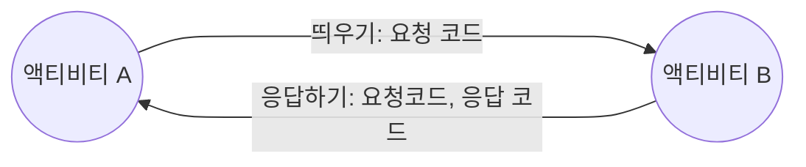

## 화면 간 전환하기

 1. 새로운 액티비티 만들기 
     - 새로운 액티비티를 추가하면 XML 레이아웃 파일 하나와 자바 소스 파일 하나가 만들어지고 
        매니페스트 파일에 액티비티 태그가 추가된다.
        
 2. 새로운 액티비티의 XML 레이아웃 정의하기
    - 새로 만들어진 XML 레이아웃을 수정하여 새로운 액티비티의 화면이 어떻게 배치될지 작성한다.
    
 3. 메인 액티비티에서 새로운 액티비티 띄우기
    - 메인 액티비티의 버튼을 클릭하면 startActivityForResult 메서드로 새로운 액티비티를 띄운다.

 4. 새로운 액티비티에서 응답 보내기
    - 새로운 액티비티가 보이고 그 안에 들어가 있는 버튼을 클릭하면 setResult 메서드로 응답을 보낸다. 

 5. 응답 처리하기
	   - 메인 Activity에서 onActivityResult method를 정의하여 새로 띄웠던 액티비티에서 보내오는
	     응답을 처리

MenuActivity 를 만들어 준 후 소스 파일을 수정한다. 

```java

public class MenuActivity extends AppCompatActivity {

    @Override
    protected void onCreate(Bundle savedInstanceState) {
        super.onCreate(savedInstanceState);
        setContentView(R.layout.activity_menu);

        Button button = findViewById(R.id.button2);  // 버튼 객체 참조
       button.setOnClickListener((v)->{
            Intent intent = new Intent();       // 인텐트 객체 생성
            intent.putExtra("name","mike"); // name의 값을 mike로 설정
            setResult(RESULT_OK,intent);    // 응답 보내기
            finish(); // 현재 액티비티 없애기
        });
    }
}
```

>  setResult(응답 코드, 인텐트)      // 새로 띄운 액티비티에서 이전 액티비티로 인텐트를 전달하고 싶을 때 사용

<br>
 인제 메인 엑티비티 자바 소스를 수정한다 .

```java
public class MainActivity extends AppCompatActivity {
    public static final int REQUEST_CODE_MENU = 101;
   
	@Override
    protected void onActivityResult(int requestCode, int resultCode, @Nullable Intent data) {
        super.onActivityResult(requestCode, resultCode, data);

        if (requestCode == REQUEST_CODE_MENU){
            Toast.makeText(getApplicationContext(),
                    "onActivityResult 메서드 호출됨. 요청코드 : " + requestCode +
                            ", 결과 코드 : " + resultCode, Toast.LENGTH_LONG).show();
            if(resultCode == RESULT_OK){
                String name = data.getStringExtra("name");
                Toast.makeText(getApplicationContext(), "응답으로 전달된 name: " + name,
                        Toast.LENGTH_LONG).show();
            }
        }

    }
    @Override
    protected void onCreate(Bundle savedInstanceState) {
        super.onCreate(savedInstanceState);
        setContentView(R.layout.activity_main);

        Button button = findViewById(R.id.button);
        button.setOnClickListener((v)->{
            Intent intent  = new Intent(getApplicationContext(),MenuActivity.class);
            startActivityForResult(intent,REQUEST_CODE_MENU);
        });
    }
}
```

새로운 액티비티를 띄울 때 startActivityForResult 메서드를 호출한다. 

이 메서드는 새 액티비티를 띄우지만 새 액티비티로부터 응답을 받을 수 있다.

REQUEST_CODE_MENU는 새 액티비티를 띄울 때 보낼 요청 코드이다. 이 값은 마음대로 지정해도 된다.
(앱에 들어갈 액티비티가 여러 개라면 중복되지 않는 값으로 지정 해야한다.)

이 값은 나중에 새 액티비티로부터 응답을 받을 때 다시 전달 받을 값이다.



인텐트를 만들 때 첫 번째 피라미터로는 컨텍스트(Context) 객체가 전달 되는데, 

액티비티 객체는 컨텍스트가 될 수 있기 때문에 일반적으로 this 변수를 사용할 수도 있다.

**onActivityResult 메서드는 새로 띄웠던 메뉴 액티비티가 응답을 보내오면 그 응답을 처리하는 역할을 한다.**

```java
protected void onActivityResult(int requestCode, int resultCode, Intent intent)
```

위 메소드 첫 번째 피라미터는 액티비티를 띄울 때 전달했던 요청 코드와 같고, 

이 값으로 어떤 액티비티로부터 응답을 받을 것인지 구분할 수 도 있다.

두 번째 피라미터는 새 액티비티로부터 전달된 응답 코드이다. 

응답 코드는 새 액티비티에서 처리한 결과가 정상인지 아닌지를 구분하는데 사용된다. 

세 번째 피라미터는 전달 받은 인텐트이고 이 인텐트 안에 새 액티비티의 데이터를 전달 할 수 있다. 

인텐트 객체는 주로 새 액티비티로부터 원래의 액티비티로 데이터를 전달할 때 사용하고, 

이 인텐트 객체에 데이터를 넣을 때 사용하는 가장 간단한 방법은 putExtra이다.

putExtra는 키와 데이터 값을 쌍으로 넣어야 한다.


**결과**


